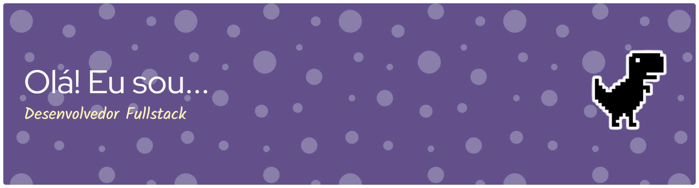

  

<h1 data-importer="text" align="center">👋🏻Olá seja bem vindo!</h1>

###

  
  
  
  
  
  
  
  
  
  
  
  
  
  
  
  
  
  
  

###

  
  
  
  
  

### 🤖 Linguagens e Tecnologias

<img 
    align="left" 
    alt="TypeScript"

###

